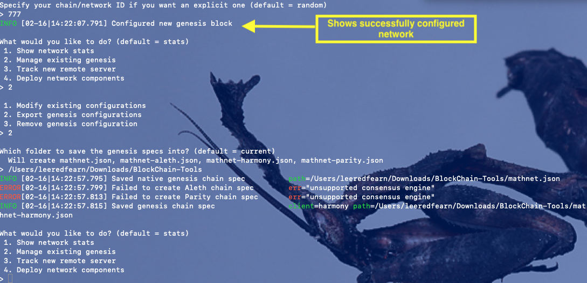

# GAINING ACCESS TO THE MATHNET TEST NETWORK FOR ZBANK

## About the BlockChain Network:
The "mathnet" test network is a POA(proof of authority) blockchain network that has been constructed to show you how nodes interact on the blockchain, as well as how to send payments to nodes on the network. The two nodes currently on the network are node1 and node2 with the following credentials:

### Node 1 Public Key: __0xFddAF50Df523aaBbeC1016B49a65Afd23dc28909__

###  Node 2 Public Key: __0x04A1a1C7a28e1aCb304A9f9E620446787d1577e8__

## To start up the nodes, create TWO SEPARATE terminal windows and  execute each of the commands in only one terminal (GitBash for Windows users):

## Command 1:
#### ./geth --datadir node1 --unlock " 0xFddAF50Df523aaBbeC1016B49a65Afd23dc28909" --mine --rpc --port 30307 --allow-insecure-unlock

## Command 2:
#### ./geth --datadir node2 --unlock "0x04A1a1C7a28e1aCb304A9f9E620446787d1577e8" --port 30308 --bootnodes "enode://c8c49f1ad52fb94abbcf85a9c84e4e5c46212b91014eed01d70775e3cc04661810a8497e4b47269b2d126da0ea2f91b8038b96b37d09bd50f6eacf6126fcd989@127.0.0.1:30307"

## ***ALERT: To avoid any issues with other applications using the 30303 and 30304 ports, nodes 1 and 2 have been set to run on ports 30307 and 30308 respectively***
## After you've successfully started the nodes on the mathnet test network, you should see an output that is similar to the following:

## You should see nonzero values in the "peercount" printout; this means the nodes can "see" each other on the network. After this, you want to open up the "MyCrypto" application and select the mathnet test network, from the left column as shown below:

## We will be accessing node1, using it's keystore file. This will give us access to the wallet created for node1 on the mathnet test network. When you click "Keystore File", your finder window will open so that you can select node1's keystore file from the ZBankNet directory folder. The directions are given in the image below:

## Once selected, the keystore file will be uploaded to the application. Next, enter the default password provided in the image below, then click "Unlock"

## You now have access node1's wallet. You can now send test ETH to node2. Copy and paste the public key address of node2, provided at the beginning of this document, and send a reasonably large amount; you're rich in ETH for the moment, so why not?. Once you set an amount, click "Send" and confirm the transaction to send test ETH to node2 

## Once you've submitted a transaction, you should see something similar to the image below. Note that your transaction may take a moment to be mined, considering all other transactions being mined. But eventually, the status of your transaction will read "SUCCESSFUL"

